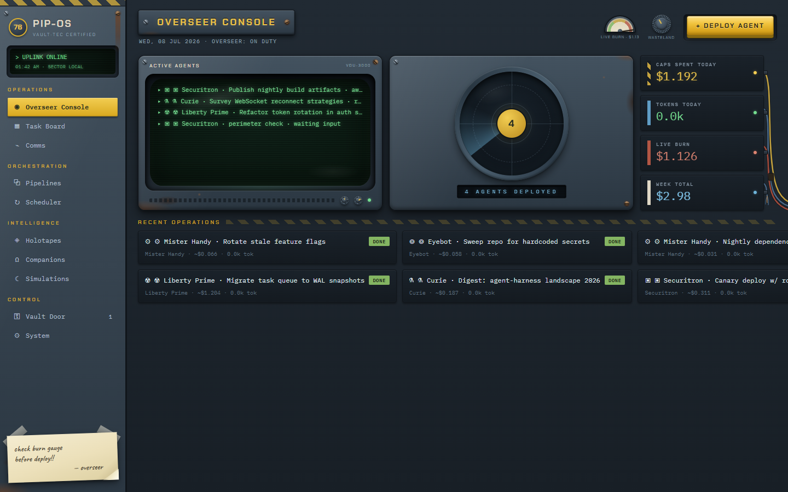
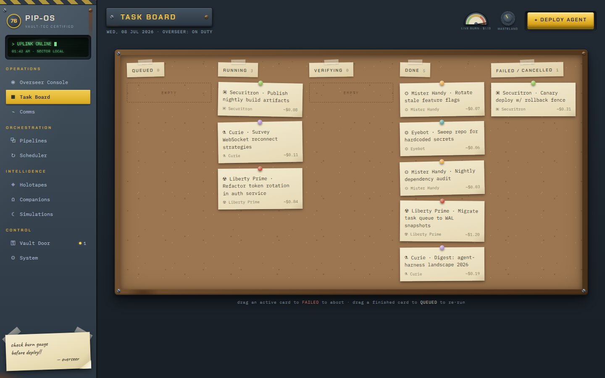
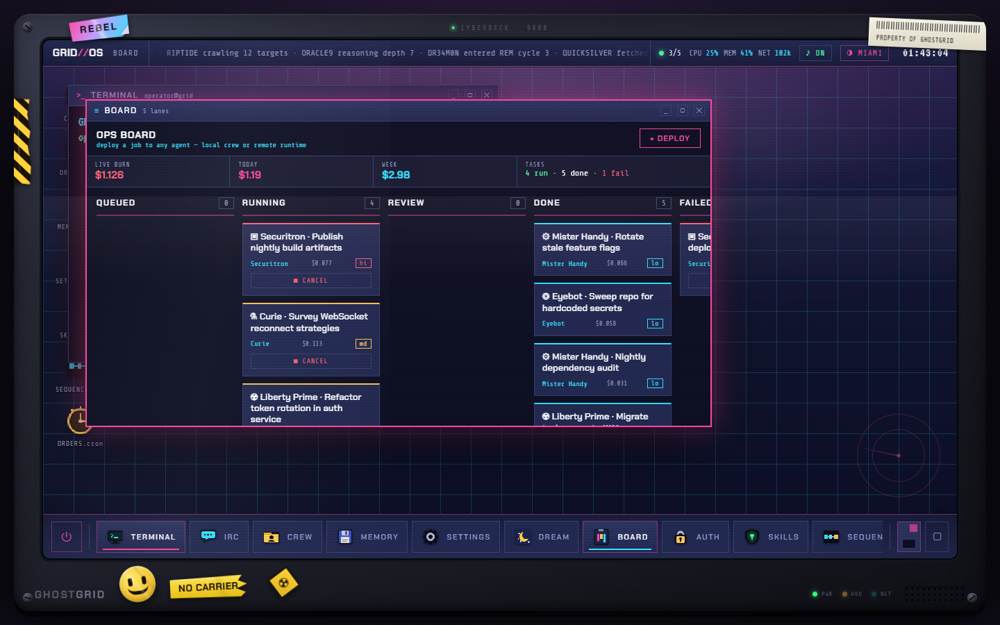
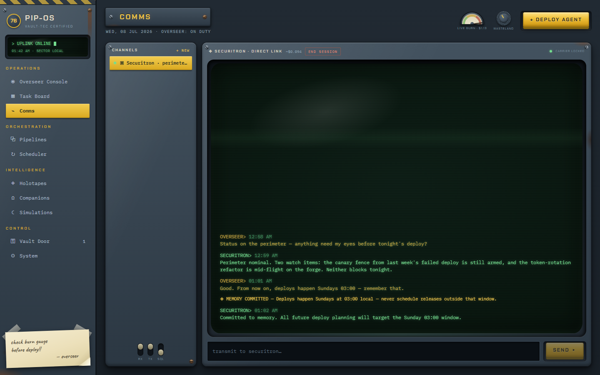
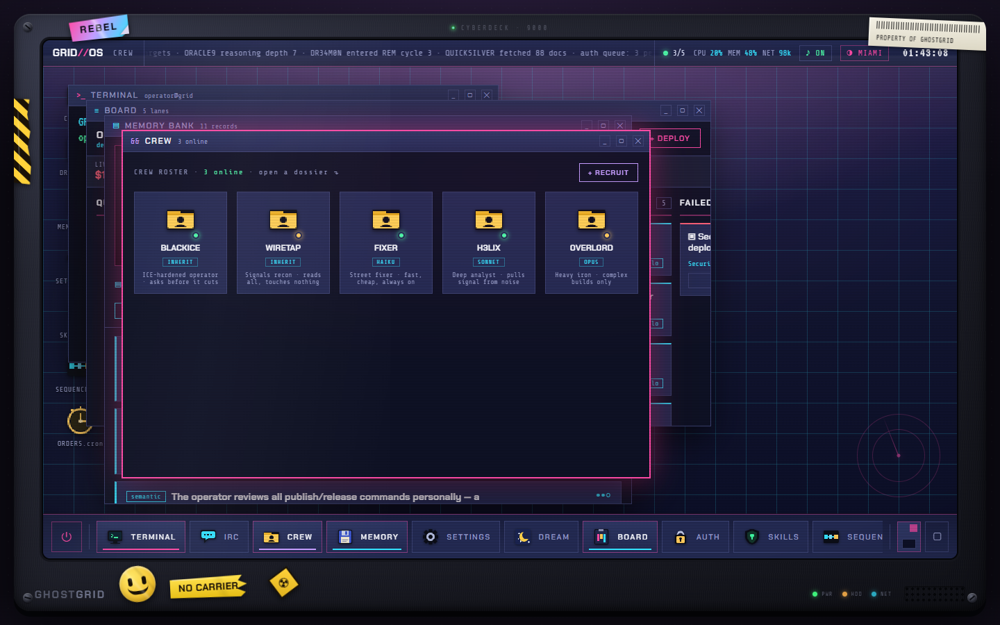
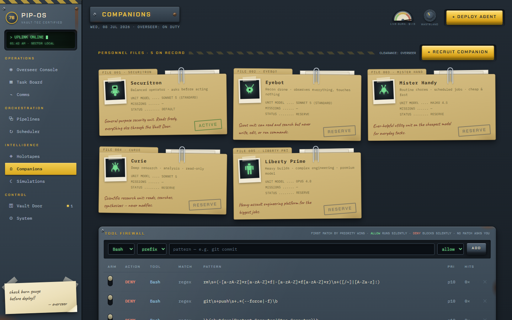
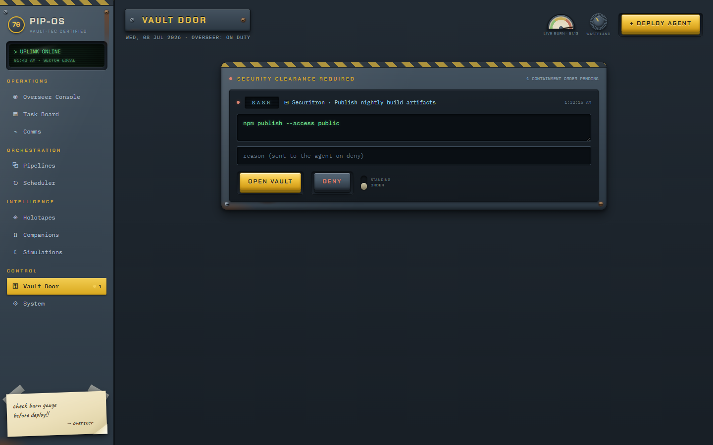
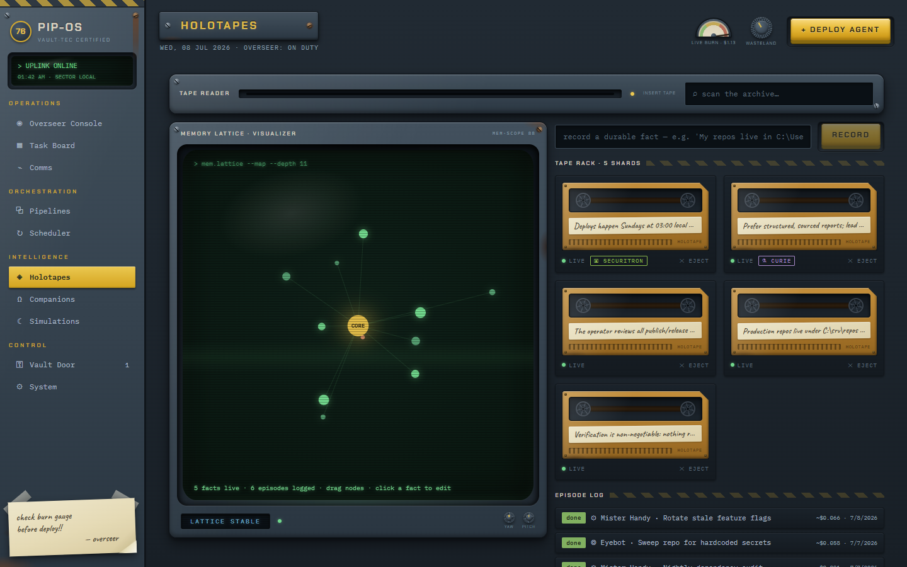
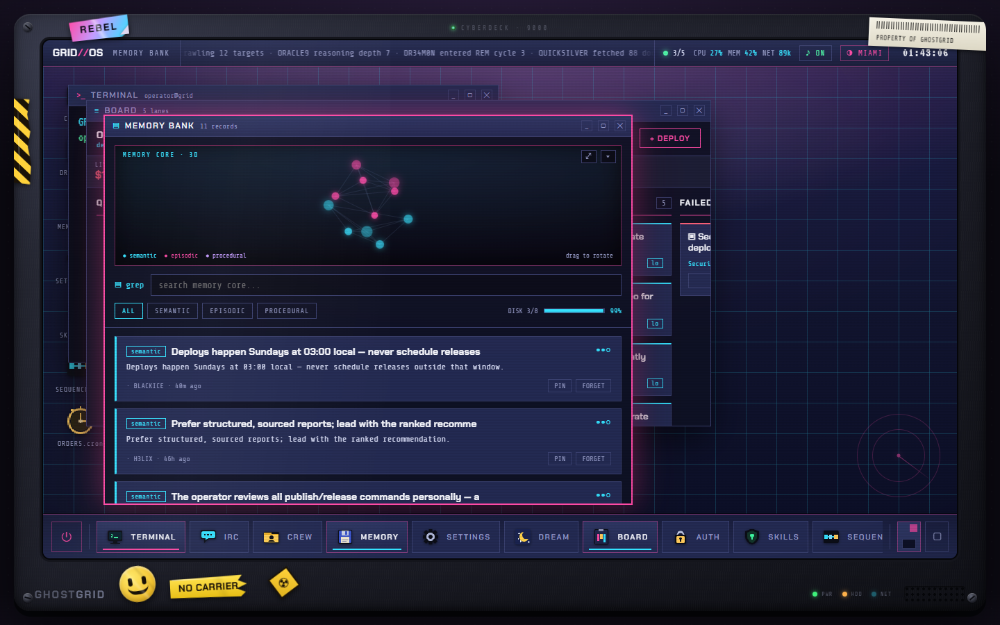
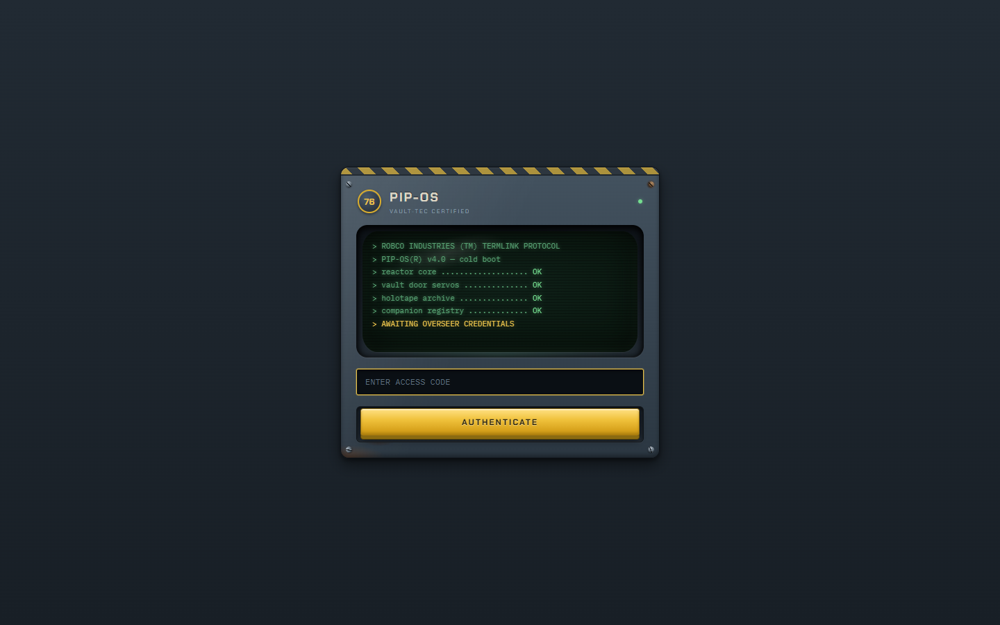

# Rezident

A self-hosted operating system for your coding agents. The UI is the OS: deploy
named agent personas onto real work, watch them stream live, approve the
dangerous parts from your phone, and let nothing reach **done** without passing
its verification command. Agents remember what they learn. The whole thing runs
on your machine, on your existing Claude subscription — no hosted services.

*(The rezident, in tradecraft, is the station chief who runs a network of
agents in the field. That's you.)*



## One OS, two faces

Every feature ships in two complete, self-contained themes — a skeuomorphic
**PIP-OS** vault console and the **GRID//OS** cyberdeck, each with its own boot
ceremony, sound design, and login. Swap live with the mode knob.

| PIP-OS · wasteland console | GRID//OS · cyberdeck |
|---|---|
|  |  |
|  |  |

## What it does

**Agents.** A roster of local Claude personas (per-agent model, permission
mode, allowed/blocked tools, system prompt) plus bridged remote runtimes over
four transports: OpenAI-compatible HTTP (16 provider presets — OpenAI,
Anthropic, Gemini, Groq, DeepSeek, Mistral, OpenRouter, Ollama, …), sign-in
CLIs (Codex/ChatGPT, Gemini, Qwen — OAuth, no API key stored), one-shot CLI
over SSH, and streaming ACP sessions over SSH. Local agents work your files
with real tools; remote runtimes are phone-a-friend experts. All of them share
one roster for tasks, chat, and pipelines.



**Supervision.** Tasks move through a validated lifecycle
(`queued → running → verifying → done/failed`) on a kanban board. Dangerous
tool calls stop at the **Vault Door**: approve (optionally after editing the
command), deny with a reason the agent hears, or mint an always-allow rule.
Push notifications (ntfy / Telegram / webhook) reach you when a task needs you
while you're away. A watchdog auto-fails wedged tasks; repo tasks run in
isolated git worktrees with one-click merge/discard; verify commands are the
only path to *done*.



**Comms.** Persistent chat channels with any agent — the session stays alive
between messages, tools and approvals included, with live token streaming from
ACP runtimes. Dead channels (a restart kills sessions) re-open in place: just
transmit, and the conversation resumes with its context intact.

**Memory.** Durable operator facts are injected into every agent — local *and*
bridged. Beyond that, each agent curates its own memory: a write-back protocol
lets any runtime save durable lessons mid-session (`◈ MEMORY COMMITTED`), which
it recalls in every future session. You see and control the whole pool —
owner-tagged, searchable, disable/eject per fact. Full design:
[docs/agent-memory.md](docs/agent-memory.md).

| Holotapes · PIP-OS | Memory Bank · GRID//OS |
|---|---|
|  |  |

**Orchestration.** Drag-and-drop pipelines chain agents (each stage hands its
result to the next — remote thinker → local builder is one wire-up). A cron
scheduler runs recurring agents with overlap policies. And while you're away,
the OS **dreams**: it reflects over its own history and proposes schedules,
rules, agents, and memory facts you can apply with one tap.

**Sound.** Both consoles are fully voiced. PIP-OS is mechanical — relay
clacks, rotary detents, a reactor swell on boot. GRID//OS ships two schemes:
**WIN95 ERA** (the genuine 1995 system sounds — CHORD on errors, TADA on
access granted, The Microsoft Sound on desktop arrival, plus the classic AIM
door/IM sounds in the IRC app) and **SYNTH** (the deck's own designed
palette). Everything is opt-out per category (UI / chat / alerts / system on
the deck; controls / verdicts / boot on the console), and everything is
overridable: drop your own `.wav` files into `data\sounds\` — named after the
cue (`ding`, `tada`, `startup`, `im`, `buddyin`, `click`, `done`, …) — and
they win over any scheme, no rebuild needed.

*Era-sound provenance: the WIN95 scheme plays original Microsoft Windows 95
system sounds and classic AOL Instant Messenger notification sounds, included
as-is for personal/nostalgic use; those recordings remain the property of
their respective owners. PIP-OS and GRID//OS are original loving homages —
no game or film assets are included.*

**Desktop.** Ships as a Windows app — a native WebView2 window around a single
local process, packaged as a onedir exe, a portable single-file exe, or a
per-user installer (`packaging/Rezident.iss`). Optional boot-level autostart via
a scheduled task (strictly opt-in), and full phone access over Tailscale/LAN
with token auth. See [PACKAGING.md](PACKAGING.md).



## Quickstart (from source)

Requires: Windows, Python 3.11+, Node 20+, Git for Windows, and an
authenticated `claude` CLI (Claude Code).

```powershell
# first-time setup
cd backend
python -m venv .venv
.\.venv\Scripts\pip install -e .
python -c "import secrets; print('AGENTOS_TOKEN=' + secrets.token_urlsafe(32))" > .env
cd ..\frontend
npm install && npm run build

# run (serves the built frontend on the same port)
cd ..\backend
.\.venv\Scripts\python.exe -m agentos
```

Open http://localhost:8734 and authenticate with the token from `backend/.env`.

> Rezident began life as "AgentOS" — internal identifiers (the `agentos`
> Python package, `AGENTOS_*` env vars, `agentos_*` browser-storage keys) keep
> that name so existing installs and data upgrade cleanly.

**From your phone**: browse to `http://<LAN-or-Tailscale-IP>:8734`, log in with
the same token, and approve agent actions from anywhere — the UI collapses to a
bottom tab bar on small screens. Prefer Tailscale over plain LAN away from
home; the token rides the WebSocket query string, so the encrypted transport
matters.

**Desktop build**: `PACKAGING.md` covers the PyInstaller exe, the portable
onefile, the Inno Setup installer, and headless verification.

## Architecture notes

- **Stack**: FastAPI + `claude-agent-sdk` (one `ClaudeSDKClient` per task) +
  SQLite (WAL, versioned migrations) + WebSocket; React + Vite + TypeScript +
  zustand. GRID//OS is a self-contained static app bridged over `postMessage`.
- **Task lifecycle**: every transition is validated in `task_manager.py` and
  persisted as a `status_change` event. Chats park in `waiting_input` with the
  SDK client alive and bypass the concurrency budget.
- **Events are persist-first**: each event lands in `task_events` with a
  per-task monotonic `seq`, then fans out over WebSocket; reconnecting clients
  replay `after_seq` — no gaps. Token streams are transient by design; the
  persisted message is authoritative.
- **Approvals** (`approvals.py`): `can_use_tool` pauses the agent mid-call; a
  rules engine auto-allows/denies known patterns and queues the rest for human
  sign-off.
- **Integrations** (`integrations.py`): one dispatch layer, four transports,
  endpoint-shape-aware URLs, lazy SSH tunnels. Operator memory is injected at
  the runner level for every transport.
- **Memory** (`memory.py`): global facts + per-agent facts
  (`memory_facts.agent_key`), agent write-back via an in-band fenced block —
  no tools or tokens needed, so remote runtimes can remember too.
- **Verification**: verify commands run via Git Bash in the task cwd; exit 0
  is the only path to `done`. `data/scratch` is git-fenced so agents can't
  walk up into the Rezident repo itself.
- **Resilience**: backend restarts orphan-sweep active tasks; chat channels
  resume via session ids; an idle watchdog hard-frees wedged concurrency
  slots; single-instance + cross-session guards prevent double-serving the DB.

## Docs

- [PACKAGING.md](PACKAGING.md) — desktop packaging, installer, autostart, data locations
- [docs/agent-memory.md](docs/agent-memory.md) — the per-agent memory + write-back design
- [docs/agent-homes.md](docs/agent-homes.md) — durable per-agent workspaces

## License

[Elastic License 2.0](LICENSE) — free to use, copy, modify, and self-host;
you may not offer Rezident to third parties as a hosted or managed service.

*Screenshots show a seeded demo workspace.*
