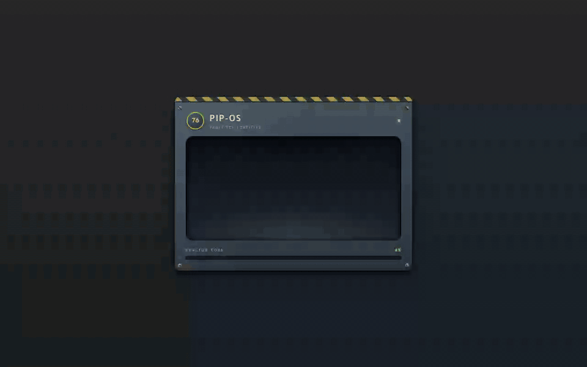

<div align="center">


# Rezident

**A self-hosted operating system for your coding agents.**

Deploy named agent personas onto real work, watch them stream live, approve
the dangerous parts from your phone, and let nothing reach *done* without
passing its verification command — on your machine, on your existing Claude
subscription. No hosted services.

[](https://github.com/spezzuti/Rezident/releases)
[](LICENSE)
[](#install-windows)

[Install](#install-windows) · [Quickstart](#quickstart-from-source) ·
[Highlights](#highlights) · [Security](#security) · [Docs](#docs)

</div>



*(The rezident, in tradecraft, is the station chief who runs a network of
agents in the field. That's you.)*

## Highlights

- **One roster, many runtimes** — local Claude personas with real tools, plus
  bridged remote agents over four transports: OpenAI-compatible HTTP (16
  provider presets), sign-in CLIs (Codex, Gemini, Qwen), one-shot CLI over
  SSH, and streaming ACP sessions.
- **Supervised lifecycle** — tasks move `queued → running → verifying →
  done/failed` on a kanban board; a passing verify command is the only path
  to *done*.
- **The Vault Door** — dangerous tool calls pause for approve / edit / deny /
  always-allow, with push notifications (ntfy, Telegram, webhook, FCM) when
  you're away.
- **Roundtable** — put two or more agents in one channel to argue a problem
  out on a shared transcript; you moderate, `[CONSENSUS]` ends the session.
- **Memory** — durable operator facts injected into every agent, plus
  per-agent write-back memory you can inspect, disable, or eject.
- **Knowledge (RAG)** — index folders of docs into knowledge bases (Ollama
  embeddings out of the box) and attach them per-agent; local and bridged
  runtimes both retrieve.
- **Orchestration** — drag-and-drop pipelines, a cron scheduler, and a
  *dreams* pass that proposes schedules, rules, and agents while you're away.
- **Phone companion** — a native Android app: QR pairing, scoped per-device
  tokens, and Approve/Deny from the lock screen via push.
- **Remote access, bundled** — one click makes the app its own Tailscale node
  (embedded tsnet): no VPS, no port-forward, no admin, no driver.
- **Secrets sandbox** — agents run with a scrubbed environment and a path
  guard walling off tokens and keys; on by default.
- **Two complete themes** — the PIP-OS vault console and the GRID//OS
  cyberdeck, each fully voiced with its own boot ceremony and login.

## One OS, two faces

Every feature ships in two complete, self-contained themes — a skeuomorphic
**PIP-OS** vault console and the **GRID//OS** cyberdeck, each with its own boot
ceremony, sound design, and login. Swap live with the mode knob.

| PIP-OS · wasteland console | GRID//OS · cyberdeck |
|---|---|
|  |  |
|  |  |

## What it does

**Agents.** A roster of local Claude personas (per-agent model, permission
mode, allowed/blocked tools, system prompt) plus bridged remote runtimes over
four transports: OpenAI-compatible HTTP (16 provider presets — OpenAI,
Anthropic, Gemini, Groq, DeepSeek, Mistral, OpenRouter, Ollama, …), sign-in
CLIs (Codex/ChatGPT, Gemini, Qwen — OAuth, no API key stored), one-shot CLI
over SSH, and streaming ACP sessions over SSH. Local agents work your files
with real tools; remote runtimes are phone-a-friend experts. All of them share
one roster for tasks, chat, roundtables, and pipelines.


**Supervision.** Tasks move through a validated lifecycle
(`queued → running → verifying → done/failed`) on a kanban board. Dangerous
tool calls stop at the **Vault Door**: approve (optionally after editing the
command), deny with a reason the agent hears, or mint an always-allow rule.
Push notifications (ntfy / Telegram / webhook / FCM) reach you when a task
needs you while you're away. A watchdog auto-fails wedged tasks; repo tasks
run in isolated git worktrees with one-click merge/discard; verify commands
are the only path to *done*.


**Comms.** Persistent chat channels with any agent — the session stays alive
between messages, tools and approvals included, with live token streaming from
ACP runtimes. Dead channels (a restart kills sessions) re-open in place: just
transmit, and the conversation resumes with its context intact.

**Roundtable.** When one brain isn't enough, convene several: two or more
agents — Claude personas and bridged runtimes alike (Claude + Codex is the
classic pairing) — take turns on one shared, speaker-attributed transcript.
You moderate: interject mid-session or press CONTINUE, and a `[CONSENSUS]`
marker lets the panel end early with a joint conclusion. Works in both themes.

**Memory.** Durable operator facts are injected into every agent — local *and*
bridged. Beyond that, each agent curates its own memory: a write-back protocol
lets any runtime save durable lessons mid-session (`◈ MEMORY COMMITTED`), which
it recalls in every future session. You see and control the whole pool —
owner-tagged, searchable, disable/eject per fact. Full design:
[docs/agent-memory.md](docs/agent-memory.md).

| Holotapes · PIP-OS | Memory Bank · GRID//OS |
|---|---|
|  |  |

**Knowledge.** Point a knowledge base at a folder of docs and Rezident chunks,
embeds, and indexes it — any embeddings provider works; a local
[Ollama](https://ollama.com) with `nomic-embed-text` is the zero-config path.
Attach knowledge bases per-agent: local Claude agents get a `search_knowledge`
tool, bridged runtimes get the relevant passages injected automatically.

**Orchestration.** Drag-and-drop pipelines chain agents (each stage hands its
result to the next — remote thinker → local builder is one wire-up). A cron
scheduler runs recurring agents with overlap policies. And while you're away,
the OS **dreams**: it reflects over its own history and proposes schedules,
rules, agents, and memory facts you can apply with one tap.

**Your phone.** Pair a handset from **Handsets**: scan one QR and the phone
becomes a scoped device with its own revocable token — never the master token,
default-deny beyond tasks and approvals, expiring after 90 days by default.
The native Android companion app (`mobile/`, Capacitor) adds push with inline
**Approve / Deny** — resolve a gated tool call from the lock screen without
opening the app.

**Remote access.** Rezident bundles an embedded Tailscale node (a userspace
[tsnet](https://pkg.go.dev/tailscale.com/tsnet) helper), so reaching it from
anywhere is one click — no VPS, no router port-forward, no network driver, no
admin prompt, no public exposure. Click **Connect** during pairing (or in
System), approve one link, and the pairing QR automatically advertises the
tailnet address — the phone keeps working from home, cellular, anywhere. The
server itself never leaves `127.0.0.1`. Details:
[docs/TAILSCALE.md](docs/TAILSCALE.md).

**Sound.** Both consoles are fully voiced. PIP-OS is mechanical — relay
clacks, rotary detents, a reactor swell on boot. GRID//OS ships two schemes:
**WIN95 ERA** (the genuine 1995 system sounds — CHORD on errors, TADA on
access granted, The Microsoft Sound on desktop arrival, plus the classic AIM
door/IM sounds in the IRC app) and **SYNTH** (the deck's own designed
palette). Everything is opt-out per category, and everything is overridable:
drop your own `.wav` files into `data\sounds\` — named after the cue (`ding`,
`tada`, `startup`, `im`, `buddyin`, `click`, `done`, …) — and they win over
any scheme, no rebuild needed.

*Era-sound provenance: the WIN95 scheme plays original Microsoft Windows 95
system sounds and classic AOL Instant Messenger notification sounds, included
as-is for personal/nostalgic use; those recordings remain the property of
their respective owners. PIP-OS and GRID//OS are original loving homages —
no game or film assets are included.*

**Desktop.** Ships as a Windows app — a native WebView2 window around a single
local process, packaged as a onedir exe, a portable single-file exe, or a
per-user installer (`packaging/Rezident.iss`). Optional boot-level autostart
via a scheduled task (strictly opt-in), self-updating, with bundled Tailscale
remote access. See [PACKAGING.md](PACKAGING.md).


## Install (Windows)

Grab the latest build from
[**Releases**](https://github.com/spezzuti/Rezident/releases):

- **`Rezident-Setup.exe`** — per-user installer (no admin needed): Start Menu
  entry plus optional desktop and startup shortcuts.
- **`Rezident.exe`** — portable single-file build; keep it anywhere, your data
  lives in `%LOCALAPPDATA%\Rezident`.

Requires an authenticated [Claude Code](https://claude.com/claude-code) CLI
(install `claude`, run it once, `/login`), and Git for Windows for repo tasks —
the app's boot checklist verifies both and links the fixes.

> [!NOTE]
> The exes are unsigned, so SmartScreen will ask once — *More info → Run
> anyway*.

## Quickstart (from source)

Requires: Windows, Python 3.11+, Node 20+, Git for Windows, and an
authenticated `claude` CLI (Claude Code).

```powershell
# first-time setup
cd backend
python -m venv .venv
.\.venv\Scripts\pip install -e .
python -c "import secrets; print('AGENTOS_TOKEN=' + secrets.token_urlsafe(32))" > .env
cd ..\frontend
npm install && npm run build

# run (serves the built frontend on the same port)
cd ..\backend
.\.venv\Scripts\python.exe -m agentos
```

Open http://localhost:8734 and authenticate with the token from `backend/.env`.
(Desktop builds skip all of this — they provision a token automatically and
store it encrypted.)

To use it from your phone, pair a handset (see **Your phone** above) — and
flip on Tailscale for anywhere-access. The server binds loopback by default;
plain-LAN exposure is a deliberate opt-in.

> [!NOTE]
> Rezident began life as "AgentOS" — internal identifiers (the `agentos`
> Python package, `AGENTOS_*` env vars, `agentos_*` browser-storage keys) keep
> that name so existing installs and data upgrade cleanly.

## Security

Rezident hands real tools to language models, so containment is a feature,
not a footnote:

- **Approvals by default.** Dangerous tool calls stop at the Vault Door, and
  the always-allow rules that bypass it can only be minted by the operator's
  master token — never from a paired device.
- **Secrets sandbox, on by default.** Agent child processes get an
  allowlisted environment (API keys and tokens scrubbed out), and a path
  guard denies agent reads of the token store, the database, `~/.ssh`, and
  `~/.claude`.
- **Token hygiene.** The master token is encrypted at rest (Windows DPAPI);
  WebSockets authenticate with 60-second single-use tickets instead of
  putting bearer tokens in URLs.
- **Scoped devices.** Paired phones hold their own tokens — stored
  sha256-hashed, default-deny beyond tasks/approvals, revocable in one tap,
  expiring after 90 days by default.
- **Loopback first.** The server binds `127.0.0.1` unless you explicitly opt
  into LAN exposure; the bundled Tailscale path keeps it that way and rides
  WireGuard for transport encryption.

Found a hole? Please report it privately (GitHub → Security → *Report a
vulnerability*) rather than in a public issue.

## Architecture notes

- **Stack**: FastAPI + `claude-agent-sdk` (one `ClaudeSDKClient` per task) +
  SQLite (WAL, versioned migrations) + WebSocket; React + Vite + TypeScript +
  zustand. GRID//OS is a self-contained static app bridged over `postMessage`.
- **Task lifecycle**: every transition is validated in `task_manager.py` and
  persisted as a `status_change` event. Chats park in `waiting_input` with the
  SDK client alive and bypass the concurrency budget.
- **Events are persist-first**: each event lands in `task_events` with a
  per-task monotonic `seq`, then fans out over WebSocket; reconnecting clients
  replay `after_seq` — no gaps. Token streams are transient by design; the
  persisted message is authoritative.
- **Approvals** (`approvals.py`): `can_use_tool` pauses the agent mid-call; a
  rules engine auto-allows/denies known patterns and queues the rest for human
  sign-off.
- **Integrations** (`integrations.py`): one dispatch layer, four transports,
  endpoint-shape-aware URLs, lazy SSH tunnels. Operator memory is injected at
  the runner level for every transport.
- **Memory** (`memory.py`): global facts + per-agent facts
  (`memory_facts.agent_key`), agent write-back via an in-band fenced block —
  no tools or tokens needed, so remote runtimes can remember too.
- **Knowledge** (`knowledge.py`): chunk → embed → brute-force cosine over
  float32 BLOBs in SQLite — deliberately no native vector extension, so
  frozen Windows builds stay dependency-free.
- **Roundtable** (`roundtable.py`): the task-event stream *is* the shared
  transcript; each turn re-drives a stateless participant over the full
  speaker-labeled history, and `[CONSENSUS]` short-circuits the rounds.
- **Devices & pairing** (`devices.py`, `api/pairing.py`): QR pair-and-claim;
  per-device tokens stored hash-only, scope-checked default-deny, TTL'd.
- **Sandbox** (`spawn_guard.py`, `sandbox.py`): an env-allowlist scrub at the
  `subprocess.Popen` chokepoint plus a `PreToolUse` path guard on the agent's
  file tools.
- **Tailscale** (`tailscale.py` + `desktop/tailscale-helper/`): a Go tsnet
  child process joins your tailnet and reverse-proxies it to loopback,
  streaming ndjson status; off by default.
- **Secrets at rest** (`secretstore.py`, `ws_tickets.py`): DPAPI-encrypted
  master token; single-use WebSocket tickets.
- **Verification**: verify commands run via Git Bash in the task cwd; exit 0
  is the only path to `done`. `data/scratch` is git-fenced so agents can't
  walk up into the Rezident repo itself.
- **Resilience**: backend restarts orphan-sweep active tasks; chat channels
  resume via session ids; an idle watchdog hard-frees wedged concurrency
  slots; single-instance + cross-session guards prevent double-serving the DB.

## Docs

- [PACKAGING.md](PACKAGING.md) — desktop packaging, installer, autostart, data locations
- [docs/TAILSCALE.md](docs/TAILSCALE.md) — bundled remote access: how it works, connect, security notes
- [docs/agent-memory.md](docs/agent-memory.md) — the per-agent memory + write-back design
- [docs/agent-homes.md](docs/agent-homes.md) — durable per-agent workspaces
- [docs/RELAY.md](docs/RELAY.md) — the (dormant) self-hosted relay alternative to Tailscale
- [mobile/FIREBASE_SETUP.md](mobile/FIREBASE_SETUP.md) — building the Android companion with push

## License

[Elastic License 2.0](LICENSE):

- **Free to use** — use, copy, modify, and self-host it, commercially or not.
- **Source available** — the entire codebase is right here.
- **One restriction** — you may not offer Rezident to third parties as a
  hosted or managed service.

*Screenshots show a seeded demo workspace.*
